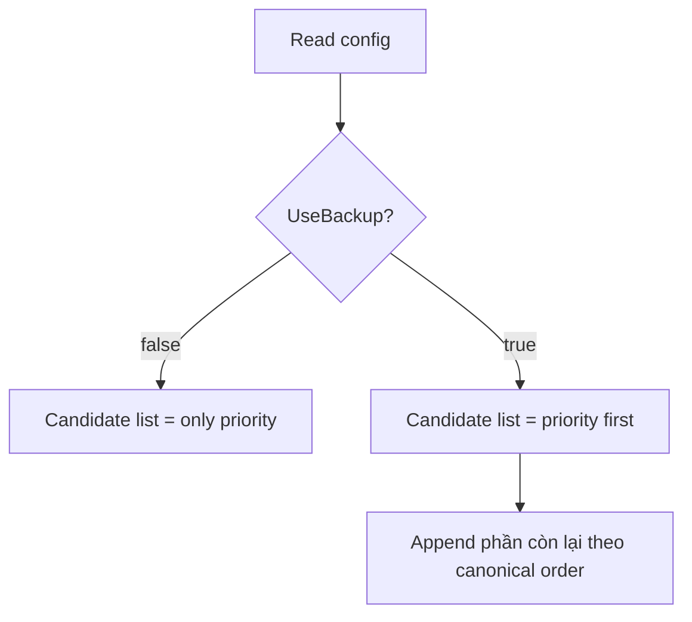
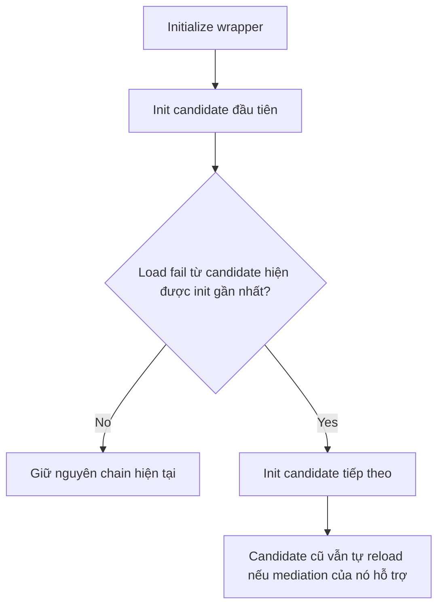
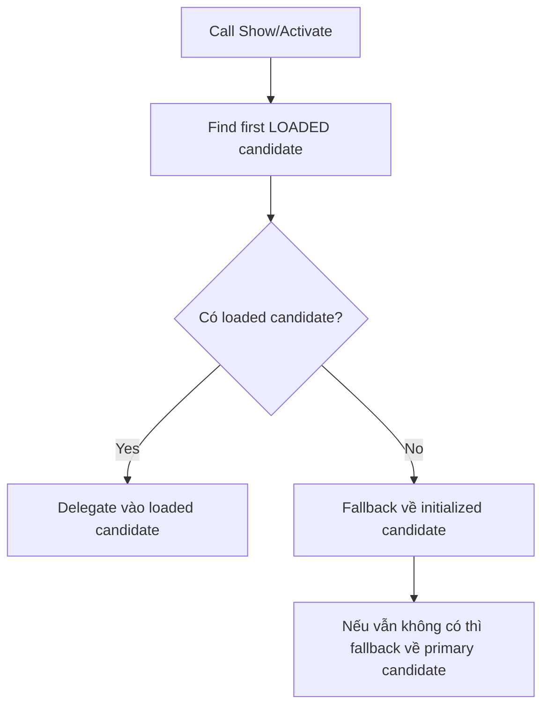
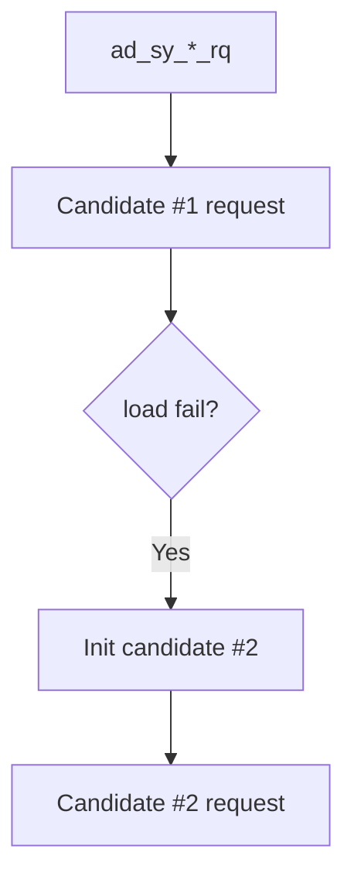
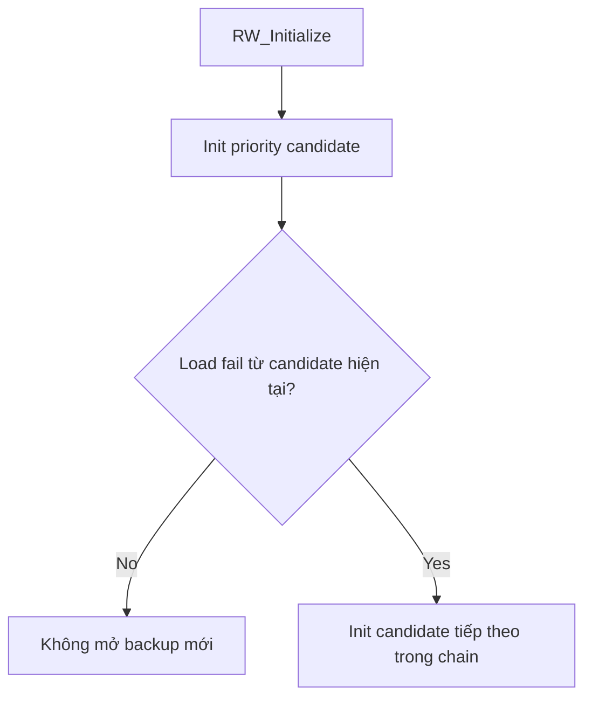
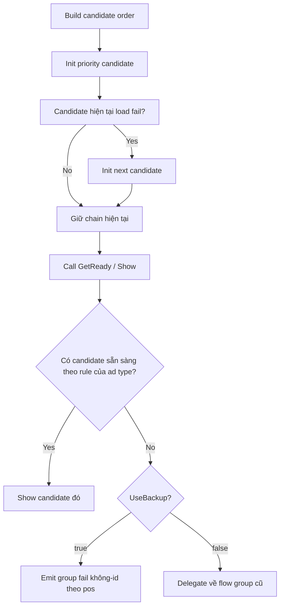

# Backup Rule Guide

File này mô tả **rule chung** của backup orchestration trong `AdCore_MainAndroid`, rồi map lại sang `Rewarded` để dễ đọc.

## 1. Mục tiêu của rule chung

Backup rule được tạo để giữ 3 việc cùng lúc:
- `Init` theo kiểu tuần tự, không preload tất cả mediation cùng lúc.
- `Show` ưu tiên mediation đúng thứ tự priority, nhưng chỉ dùng candidate nào đang sẵn sàng.
- `Tracking` đọc được rõ khi nào flow đã vào group cụ thể, và khi nào toàn bộ backup chain đều chưa sẵn sàng.

## 2. Code base chung hiện tại

Phần orchestration dùng chung bây giờ nằm ở:
- [FallbackCandidate.cs](/d:/Unity%20projects/BG-Library-Full-Module/Assets/BG_Lib/AdCore-MainForAndroid/FallbackCandidate.cs)
- [SequentialFallbackGroupBase.cs](/d:/Unity%20projects/BG-Library-Full-Module/Assets/BG_Lib/AdCore-MainForAndroid/SequentialFallbackGroupBase.cs)
- [FsFallbackGroup.cs](/d:/Unity%20projects/BG-Library-Full-Module/Assets/BG_Lib/AdCore-MainForAndroid/FsFallbackGroup.cs)
- [MrecFallbackGroup.cs](/d:/Unity%20projects/BG-Library-Full-Module/Assets/BG_Lib/AdCore-MainForAndroid/MrecFallbackGroup.cs)

Hiểu ngắn gọn:
- `FallbackCandidate<TGroup>`: một node trong chain backup.
- `SequentialFallbackGroupBase<TGroup>`: lõi rule chung cho candidate order, init-next, tracking channel, debug info, event-match.
- `FsFallbackGroup`: áp dụng cho `IFSGroup` như `Rewarded` và `AO`.
- `MrecFallbackGroup`: dùng chung lõi `SequentialFallbackGroupBase<TGroup>` cho phần `init/show`, còn `activate/hide` vẫn tách riêng để làm tiếp sau.

## 3. Rule chung của candidate chain

### 3.1 Candidate order



Canonical order của từng ad type hiện tại:
- `Rewarded`: `Admob -> Max -> Android`
- `AO`: `Admob -> Max`
- `MREC`: `Admob -> Max`

### 3.2 Init rule



Điểm quan trọng:
- Backup chỉ mở **tuần tự**.
- Candidate trước không bị tắt.
- Vì vậy theo thời gian có thể có nhiều candidate cùng tồn tại ở trạng thái:
  - `initialized`
  - `loading`
  - `ready/loaded`

## 4. Rule chung của show selection

### 4.1 FS groups: Rewarded / AO

`FsFallbackGroup` dùng rule này:

```mermaid
flowchart TD
    A[Call Show(pos)] --> B[Find first READY candidate theo candidate order]
    B --> C{Có READY candidate?}
    C -- Yes --> D[Delegate show vào candidate đó]
    C -- No --> E{UseBackup?}
    E -- true --> F[Emit group fail không-id theo pos]
    E -- false --> G[Delegate xuống candidate priority / initialized như flow cũ]
```

Ý nghĩa:
- Nếu backup bật, wrapper coi đây là fail của **cả chain**, không phải fail của riêng một group.
- Nếu backup tắt, wrapper giữ behavior cũ của group đơn.

### 4.2 Rect groups: MREC

`MrecFallbackGroup` hiện dùng cùng lõi init/show, nhưng giữ logic `activate/hide` riêng vì bản chất `MREC` là ad view:



Điểm này cố ý khác `Rewarded/AO`:
- `MREC` không bắt buộc phải chờ loaded mới được gọi `ActivateView()`.
- Nhưng khi có candidate đã loaded thì wrapper vẫn ưu tiên candidate đó.

## 5. Rule chung của tracking

## 5.1 Request tracking

Một flow request luôn có:
- `1 system entry`
- `0..n group branches`



Nghĩa là:
- `system request` chỉ có 1.
- `group request` có thể nở ra nhiều nhánh do backup mở thêm.

## 5.2 Show tracking

### Khi đã chọn được candidate cụ thể

Nếu wrapper tìm được candidate để show:
- tracking group/callback gắn vào **group thực sự được dùng**.

Ví dụ `Rewarded`:
```text
ad_sy_rw_sh_x2coin
ad_gr_sh_rw1234_x2coin_api
ad_evt_dsp_sh_rw1234_x2coin
```

### Khi backup bật và cả chain chưa sẵn sàng

Nếu `UseBackup = true` và không có candidate nào ready:

```text
ad_sy_rw_sh_x2coin
ad_gr_sh_x2coin_n_nready
```

Rule này có nghĩa là:
- fail thuộc về **cả backup chain**
- không gắn `groupId`
- chỉ giữ `pos` để đọc flow

### Khi backup tắt

Nếu `UseBackup = false`, wrapper vẫn delegate như flow group cũ:

```text
ad_sy_rw_sh_x2coin
ad_gr_sh_rw1234_x2coin_n_nready
```

## 6. Rewarded map vào rule chung như nào

`Rewarded` hiện dùng:
- [AdCore_MainAndroid.cs](/d:/Unity%20projects/BG-Library-Full-Module/Assets/BG_Lib/AdCore-MainForAndroid/AdCore_MainAndroid.cs)
  - `BuildRewardedFallbackCandidates()`
  - `BuildRewardedPriorityOrder(...)`
- [FsFallbackGroup.cs](/d:/Unity%20projects/BG-Library-Full-Module/Assets/BG_Lib/AdCore-MainForAndroid/FsFallbackGroup.cs)
  - với `trackingAdType = Rewarded`
  - `defaultChannel = Rewarded`
  - `debugPrefix = RW Fallback`

### 6.1 Rewarded init flow



### 6.2 Rewarded show flow

```mermaid
flowchart TD
    A[RW_ShowAd(pos)] --> B[Find first READY candidate theo candidate order]
    B --> C{Có candidate ready?}
    C -- Yes --> D[Show candidate đó]
    C -- No --> E{UseBackup?}
    E -- true --> F[ad_gr_sh_{pos}_n_nready]
    E -- false --> G[Delegate xuống group đơn cũ]
```

## 7. Ví dụ cụ thể với Rewarded

Giả sử:
- `priority = Max`
- `UseBackup = true`

Candidate order:
1. `Max`
2. `Admob`
3. `Android`

### Case A

| Candidate | Ready |
|---|---:|
| Max | true |
| Admob | true |
| Android | false |

Kết quả:
- `RW_GetReady() = true`
- `RW_ShowAd()` chọn `Max`
- tracking group/show gắn vào `rwMax...`

### Case B

| Candidate | Ready |
|---|---:|
| Max | false |
| Admob | true |
| Android | false |

Kết quả:
- `RW_GetReady() = true`
- `RW_ShowAd()` chọn `Admob`
- tracking gắn vào group `Admob`

### Case C

| Candidate | Ready |
|---|---:|
| Max | false |
| Admob | false |
| Android | false |

Kết quả:
- `RW_GetReady() = false`
- `RW_ShowAd()` trả `false`
- tracking:

```text
ad_sy_rw_sh_x2coin
ad_gr_sh_x2coin_n_nready
```

## 8. Flow chart tổng quát dễ nhớ nhất



## 9. Phần cũ đã được bỏ

Logic wrapper cũ không còn là source of truth nữa.
Hiện tại source thật là:
- `FallbackCandidate<TGroup>`
- `SequentialFallbackGroupBase<TGroup>`
- `FsFallbackGroup`
- `MrecFallbackGroup`

Các file cũ:
- `RewardedFallbackGroup.cs`
- `AppOpenFallbackGroup.cs`
- `RectFallbackGroup.cs`

đã được xóa khỏi source.
