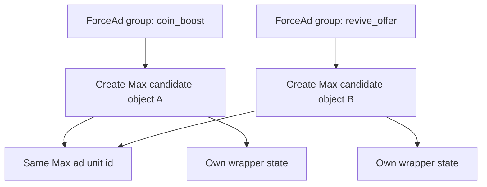
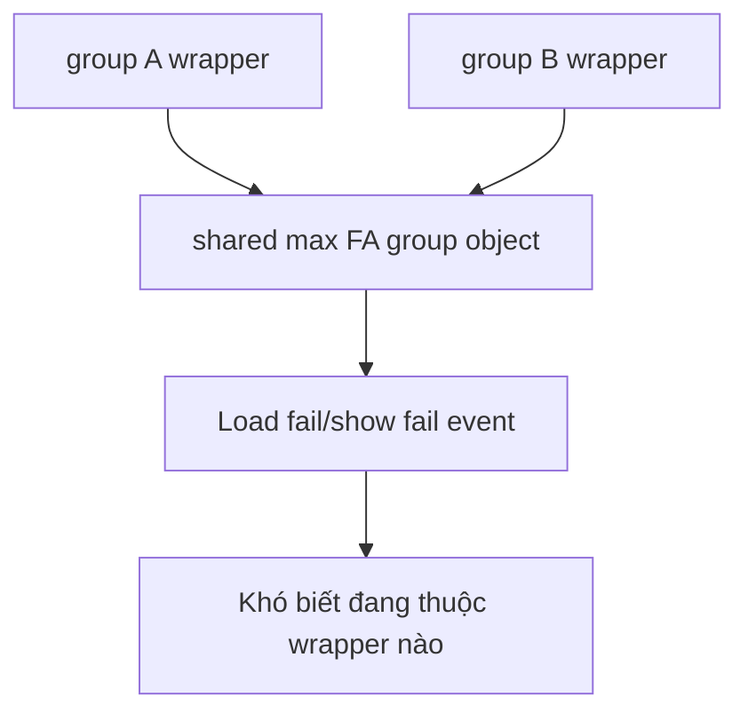
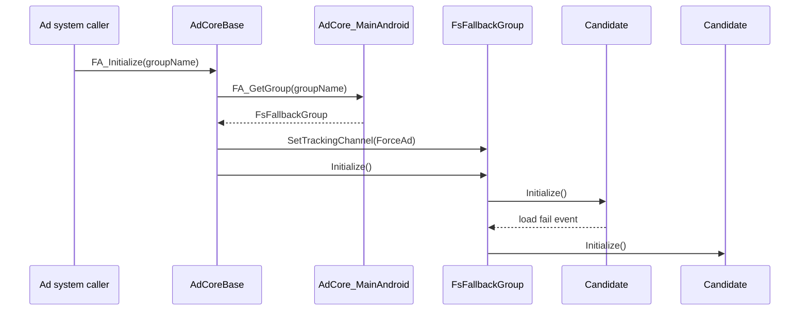
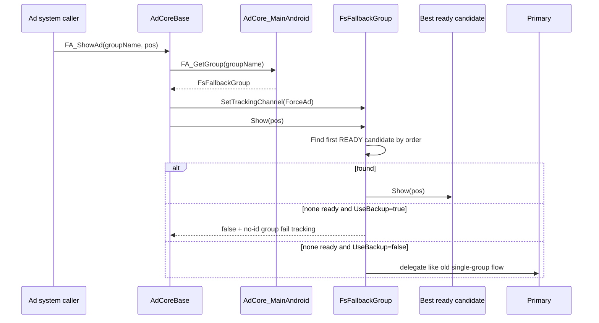
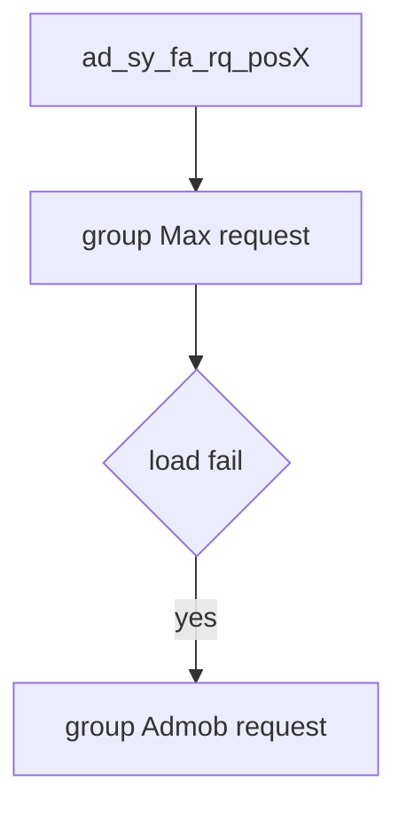

# ForceAd Backup Flow

File này mô tả đúng luồng `ForceAd` hiện tại trong code sau khi thêm `backup`.

Mục tiêu:
- hiểu `script nào làm gì`
- hiểu `hàm nào chạy lúc nào`
- hiểu `Max dùng chung ForceAdMaxUnit` nhưng vẫn tách wrapper theo `groupName` có ổn không

## 1. Kết luận ngắn

`Max` dùng chung adunit `ForceAdMaxUnit`, nhưng tạo **candidate group riêng theo từng `groupName`** là hướng ổn hơn trong kiến trúc hiện tại.

Lý do:
- `ad unit id` của MAX là tài nguyên cấu hình dùng chung
- nhưng `wrapper object` của từng `ForceAd group` cần tách riêng để giữ:
  - cache riêng
  - debug info riêng
  - event-match riêng
  - tracking context riêng theo `groupName`

Nếu dùng chung **một** `max.FA_Group` object cho tất cả `ForceAd group`:
- nhiều wrapper backup khác nhau sẽ cùng bám vào một object
- `load fail / show fail / ready / tracking` sẽ rất khó map ngược về đúng `groupName`
- dễ gây nhập nhằng khi nhiều `ForceAd group` cùng tồn tại

Nói ngắn:
- **shared adunit**: ổn
- **shared wrapper object**: không ổn với flow backup hiện tại

## 2. Script nào làm gì

### Tầng gọi ad

- [AdCoreBase.cs](/d:/Unity%20projects/BG-Library-Full-Module/Assets/BG_Lib/NetCore/Ads%20Logic%20System/AdCoreBase.cs)
  - giữ API chung:
  - `FA_Initialize(groupName)`
  - `FA_GetReady(groupName)`
  - `FA_ShowAd(groupName, pos, ...)`
  - tầng này **không biết backup chain bên dưới**

### Tầng resolve group theo platform Android

- [AdCore_MainAndroid.cs](/d:/Unity%20projects/BG-Library-Full-Module/Assets/BG_Lib/AdCore-MainForAndroid/AdCore_MainAndroid.cs)
  - source chính của `ForceAd backup`
  - việc nó làm:
  - tìm `ForceAdGroupConfig` theo `groupName`
  - build candidate order theo `priority + UseBackup`
  - tạo `FsFallbackGroup`
  - cache wrapper theo `groupName`

### Tầng rule chung backup

- [FallbackCandidate.cs](/d:/Unity%20projects/BG-Library-Full-Module/Assets/BG_Lib/AdCore-MainForAndroid/FallbackCandidate.cs)
  - 1 candidate trong chain

- [SequentialFallbackGroupBase.cs](/d:/Unity%20projects/BG-Library-Full-Module/Assets/BG_Lib/AdCore-MainForAndroid/SequentialFallbackGroupBase.cs)
  - giữ rule chung:
  - candidate order
  - init-next khi fail
  - tracking channel propagate
  - match event ngược về đúng candidate

- [FsFallbackGroup.cs](/d:/Unity%20projects/BG-Library-Full-Module/Assets/BG_Lib/AdCore-MainForAndroid/FsFallbackGroup.cs)
  - wrapper chung cho `IFSGroup`
  - hiện đang dùng cho:
  - `Rewarded`
  - `AO`
  - `ForceAd`

### Tầng mediation group thật

- `admob.FA_GetGroup(groupName)`
- `CreateForceAdMaxGroup(groupName)`
- `android.FA_GetGroup(groupName)`

Các group này là candidate thật để `Initialize`, `GetReady`, `Show`.

## 3. Luồng tổng thể

```mermaid
flowchart TD
    A[AdCoreBase.FA_Initialize / FA_ShowAd] --> B[AdCore_MainAndroid.FA_GetGroup(groupName)]
    B --> C{Cache hit?}
    C -- Yes --> D[Return cached FsFallbackGroup]
    C -- No --> E[Find ForceAdGroupConfig by groupName]
    E --> F[Build candidate order]
    F --> G[Create candidate groups]
    G --> H[Create FsFallbackGroup]
    H --> I[Cache by groupName]
    I --> J[Return FsFallbackGroup]
```

## 4. Candidate order được build như nào

Code chính:
- [AdCore_MainAndroid.cs](/d:/Unity%20projects/BG-Library-Full-Module/Assets/BG_Lib/AdCore-MainForAndroid/AdCore_MainAndroid.cs)
  - `BuildForceAdFallbackCandidates(...)`
  - `BuildRewardedPriorityOrder(...)`

Rule:
- nếu `UseBackup = false`
  - chỉ có đúng `priority`
- nếu `UseBackup = true`
  - `priority` đứng đầu
  - rồi phần còn lại theo canonical order:
  - `Admob -> Max -> Android`

Ví dụ:

| Priority | UseBackup | Candidate Order |
|---|---:|---|
| Admob | false | Admob |
| Max | false | Max |
| Max | true | Max -> Admob -> Android |
| Android | true | Android -> Admob -> Max |

## 5. Vì sao Max được tạo group riêng theo từng groupName

Code hiện tại:
- [AdCore_MainAndroid.cs](/d:/Unity%20projects/BG-Library-Full-Module/Assets/BG_Lib/AdCore-MainForAndroid/AdCore_MainAndroid.cs)
  - `CreateForceAdMaxGroup(groupName)`

Nó đang làm:

```text
Max ad unit id   = configs.ForceAdMaxUnit.MaxUnit
Wrapper groupName = force ad groupName hiện tại
```

Nghĩa là:
- `id` dùng chung
- nhưng `group controller object` là object mới theo từng `groupName`

### Tại sao cách này hợp lý



Tức là:
- cả hai candidate cùng dùng 1 `MaxUnit`
- nhưng mỗi group vẫn giữ:
  - object state riêng
  - cache riêng
  - debug line riêng
  - fallback chain riêng

### Nếu chỉ dùng một shared Max wrapper object



Đó là lý do mình coi cách hiện tại là đúng hơn cho kiến trúc backup.

## 6. Init flow chạy lúc nào

Entry point:
- [AdCoreBase.cs](/d:/Unity%20projects/BG-Library-Full-Module/Assets/BG_Lib/NetCore/Ads%20Logic%20System/AdCoreBase.cs)
  - `FA_Initialize(groupName, ...)`

Call chain:



Rule:
- init đầu tiên chỉ mở candidate đầu
- nếu candidate đang là `highestInitializedIndex` bị `load fail`
  - wrapper mở candidate kế tiếp
- `DisablePostInitReload`
  - chỉ ảnh hưởng **nội bộ candidate**
  - không chặn wrapper mở backup candidate tiếp theo

## 7. Show flow chạy lúc nào

Entry point:
- [AdCoreBase.cs](/d:/Unity%20projects/BG-Library-Full-Module/Assets/BG_Lib/NetCore/Ads%20Logic%20System/AdCoreBase.cs)
  - `FA_ShowAd(groupName, pos, ...)`

Call chain:



## 8. Rule chọn candidate để show

Code chính:
- [FsFallbackGroup.cs](/d:/Unity%20projects/BG-Library-Full-Module/Assets/BG_Lib/AdCore-MainForAndroid/FsFallbackGroup.cs)
  - `Show(...)`
  - `GetBestReadyCandidate()`

Rule:
- duyệt candidate theo thứ tự đã build
- candidate nào `GetReady() == true` đầu tiên thì được show
- không quan trọng candidate đó là mediation nào
- nếu `priority` hồi lại ready thì nó lại được ưu tiên trong các lần show sau

Ví dụ:

| Order | Candidate | Ready |
|---:|---|---:|
| 1 | Max | false |
| 2 | Admob | true |
| 3 | Android | true |

Kết quả:
- show `Admob`

## 9. Tracking của ForceAd backup

### Request

`system request` vẫn chỉ có 1 entry đầu.

Nếu backup mở thêm candidate sau `load fail`, group request có thể nở nhiều branch.



### Show success

Nếu `Admob` là candidate ready đầu tiên:

```text
ad_sy_fa_sh_revive_offer
ad_gr_sh_faGroup123_revive_offer_api
ad_evt_dsp_sh_faGroup123_revive_offer
```

Tracking group/callback gắn với **candidate thật được dùng**.

### Show fail khi backup bật

Nếu `UseBackup = true` mà không có candidate nào ready:

```text
ad_sy_fa_sh_revive_offer
ad_gr_sh_revive_offer_n_nready
```

Ở đây:
- không gắn `groupId`
- vì fail được hiểu là fail của cả backup chain

### Show fail khi backup tắt

Nếu `UseBackup = false`:

```text
ad_sy_fa_sh_revive_offer
ad_gr_sh_faGroup123_revive_offer_n_nready
```

Lúc này vẫn giữ flow cũ của group đơn.

## 10. Script-hàm nào chạy lúc nào

### Khi init

1. `AdCoreBase.FA_Initialize(groupName)`
2. `AdCore_MainAndroid.FA_GetGroup(groupName)`
3. `AdCore_MainAndroid.BuildForceAdFallbackCandidates(...)`
4. `FsFallbackGroup.Initialize()`
5. `SequentialFallbackGroupBase.InitializeNextCandidate(...)`
6. candidate đầu tiên `Initialize()`
7. nếu `load fail`:
   - `FsFallbackGroup.HandleFsLoadFailed(...)`
   - `InitializeNextCandidate("load_fail", ...)`

### Khi show

1. `AdCoreBase.FA_ShowAd(groupName, pos, ...)`
2. `AdCore_MainAndroid.FA_GetGroup(groupName)`
3. `FsFallbackGroup.Show(pos, ...)`
4. `FsFallbackGroup.GetBestReadyCandidate()`
5. nếu có:
   - candidate `Show(pos, ...)`
6. nếu không có và `UseBackup=true`:
   - `NetTrackingSystem.ShowGroupFail(GroupAdType.ForceAd, pos, TrackingReason.NotReady, Channel.ForceAd)`
7. nếu không có và `UseBackup=false`:
   - delegate về candidate priority/initialized như flow cũ

## 11. Một lưu ý thực tế

Vì `Max` đang dùng chung `ForceAdMaxUnit`:
- nhiều `ForceAd group` khác nhau có thể cùng tạo candidate `Max`
- nên ở mức inventory/adunit, chúng vẫn đang bám vào cùng một nguồn quảng cáo

Điều này **không sai**, vì đây chính là yêu cầu cấu hình hiện tại.

Điều quan trọng là:
- đừng dùng chung **wrapper object**
- chỉ dùng chung **adunit id**

Đó là điểm hệ thống hiện tại đang làm đúng.
